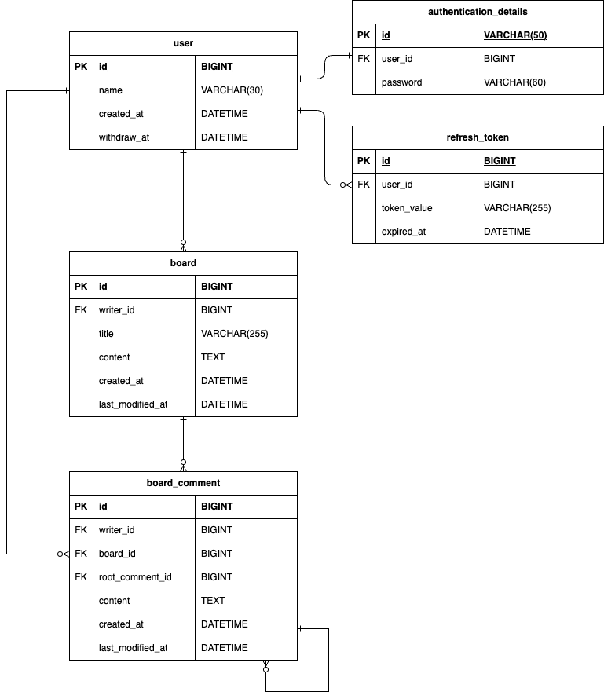
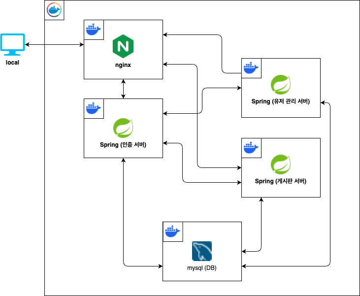

# expandable-application

## 🧩 프로젝트 소개

expandable-application은 MSA(Microservice Architecture) 환경을 직접 경험해보기 위해 제작된 프로젝트입니다.
Docker와 Docker Compose를 이용해 유저 관리, 게시판, 인증/인가 기능을 각각 독립된 마이크로서비스로 분리하고, 이를 통합하여 하나의 애플리케이션처럼 동작하도록 구성하였습니다.

서비스 간 통신은 Feign Client를 통해 구현되어 있으며, 각 서비스는 서로 독립적으로 배포 및 관리될 수 있으면서도, 유기적으로 연결되어 하나의 완성된 서비스로 작동합니다.

---

## 🎯 프로젝트 목적
- Docker 기반 MSA 환경을 구성하여 실제 서비스를 운영하는 방식에 대한 경험
- 각 도메인별로 독립된 마이크로서비스 개발 및 운영 환경 경험
- 서비스 간 통신을 통한 유기적인 연동 구조 이해

---

### ⚙️ 분리된 구조 장점
- 서비스별 독립적인 개발 및 배포 가능
- 각 서비스의 확장성 향상 및 장애 격리
- 유지보수의 효율성 향상
- 서비스 간 명확한 역할 분담으로 유연한 연동 구조 구현
- 레고 블럭과 같은 서비스 조립 가능

---

## 🛠 기술 스택
- **Backend**: Spring Boot
- **Database**: MySQL
- **API Gateway**: NGINX
- **서비스 간 통신**: Feign Client
- **환경 구성**: Docker Compose

---

## 🚀 설치 및 실행 방법

### 1. Docker 설치
	- Docker 공식 페이지에서 OS에 맞는 Docker 설치

### 2. 레포지토리 클론
```bash
git clone https://github.com/Jeongyounghyeon/expandable-application.git
cd expandable-application
```

### 3. Docker Compose 실행
```bash
docker compose up --build
```

---

## ✨ 주요 기능

###  유저 관리 서비스
- 회원가입, 로그인, 프로필 조회/수정

### 게시판 서비스
- 게시글 CRUD, 댓글 기능

### 인증/인가 서비스
- JWT 기반 인증 처리, 권한에 따른 접근 제어

### 서비스 분리 및 통합
- 각 기능별 마이크로서비스 분리 개발
- Docker Compose를 이용한 통합 환경 구성
- NGINX를 이용한 API Gateway 구성 및 라우팅

---

### ERD


### System Architecture


---

## API 명세 확인
- docs/Expandable-application.postman_collection.json 파일 Postman workspace에 드래그
- 또는 workspace 우클릭 후 Import

---

## 주요 Issue
- #22 - [Bug] 유저 생성시 트랜잭션 생성 후 인증 서버를 이용한 인증 생성으로 인한 데드락 발생
